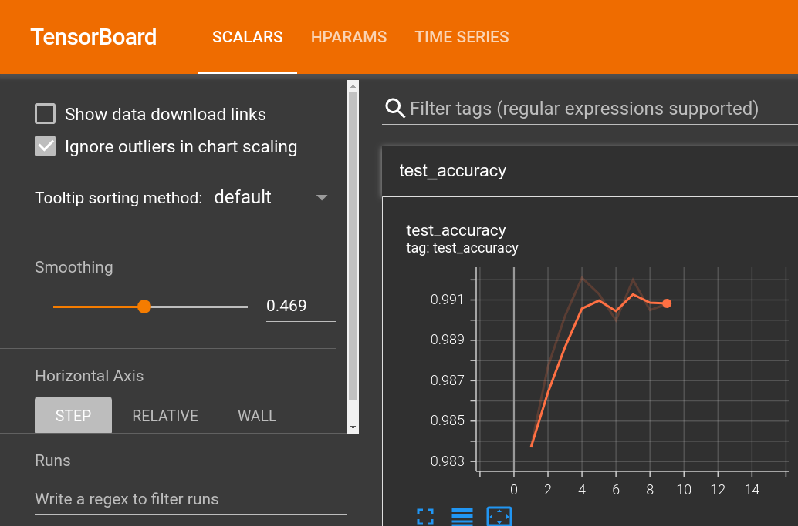

# Flax MNIST

A tiny example of running a CNN implemented with `Flax`, a neural network framework written in `JAX`.

Links:
 - [Flax](https://github.com/google/flax)
 - [JAX](https://github.com/google/jax)

## Usage
1. Install the dependencies either with `poetry install` or `pip install -r requiremenst.txt`
2. run
```shell
python flax_mnist/main.py workdir=/absolute/path/to/tensorboard/logs
```

Sample output:

```log
[2022-04-26 12:37:52,349][__main__][INFO] - epoch:  1, train_loss: 0.2560, train_accuracy: 92.32, test_loss: 0.0490, test_accuracy: 98.37
[2022-04-26 12:38:20,316][__main__][INFO] - epoch:  2, train_loss: 0.0524, train_accuracy: 98.39, test_loss: 0.0369, test_accuracy: 98.77
[2022-04-26 12:38:48,451][__main__][INFO] - epoch:  3, train_loss: 0.0353, train_accuracy: 98.91, test_loss: 0.0278, test_accuracy: 99.02
[2022-04-26 12:39:18,839][__main__][INFO] - epoch:  4, train_loss: 0.0265, train_accuracy: 99.16, test_loss: 0.0270, test_accuracy: 99.21
[2022-04-26 12:39:49,807][__main__][INFO] - epoch:  5, train_loss: 0.0228, train_accuracy: 99.29, test_loss: 0.0287, test_accuracy: 99.13
[2022-04-26 12:40:20,280][__main__][INFO] - epoch:  6, train_loss: 0.0173, train_accuracy: 99.45, test_loss: 0.0304, test_accuracy: 99.00
[2022-04-26 12:40:51,728][__main__][INFO] - epoch:  7, train_loss: 0.0149, train_accuracy: 99.52, test_loss: 0.0273, test_accuracy: 99.20
```

Tensorboard logs can be viewed with command:

```shell
tensorboard --logdir /absolute/path/to/tensorboard/logs
```

Example output:



Training is performed with CPU by default. To enable GPU pass `device=gpu` to the training script.
